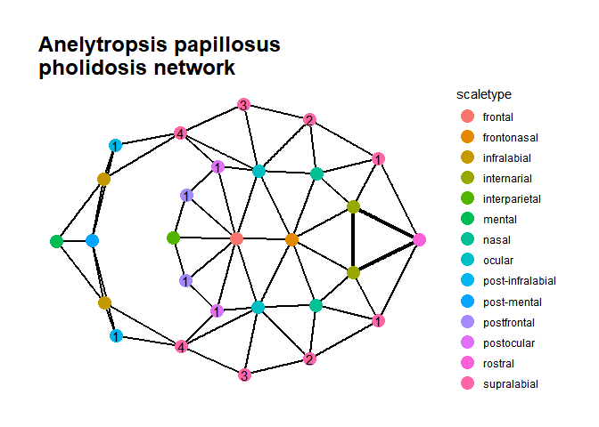

Comparative methods for biological surface patterns in R: pholidosis
================
Isaac Krone
2025-01-02

# pholidosis

This vignette demonstrates the functionality of the `pholidosis`
package, which implements a novel methodology for comparing biological
surface patterns with clear homology relationships. The primary goal of
`pholidosis` is to construct an edit distance matrix that measures the
difference between patterns.

The document below provides a straightforward demonstration of the
`pholidosis` workflow, beginning with an excel workbook and ending with
a Principal Coordinates analysis based on the edit distance matrix for a
set of head scalation patterns of dibamid lizards (family Dibamidae)
from (my paper).

Future releases will provide more detailed insight into the package’s
functions and should provide some help in troubleshooting when you want
to use your own data.

## 1 - Installation

`pholidosis` makes heavy use of the `igraph` R package. See
<https://r.igraph.org/> for instructions on installing this package,
which may require installing dependencies outside of R.

`pholidosis` can be installed from GitHub with:

``` r
#install.packages("remotes")
remotes::install_github("dibamus/pholidosis")
```

Functions in `pholidosis` use various dependencies:

``` r
library('dplyr')
library('igraph')
library('readxl')
library('stringr')
library('tibble')
library('tidyverse')
library('utils')
```

## 2 - Quick start example

Let’s walk through using `pholidosis` to import a set of adjacency
matrices, visualize their corresponding graphs, and produce a distance
matrix.

To run this tutorial, you’ll need the following packages loaded:

``` r
library('igraph')
```

    ## 
    ## Attaching package: 'igraph'

    ## The following objects are masked from 'package:stats':
    ## 
    ##     decompose, spectrum

    ## The following object is masked from 'package:base':
    ## 
    ##     union

``` r
library('pholidosis')
library('readxl') 
library('ggraph') # for plotting
```

    ## Loading required package: ggplot2

``` r
library('tidygraph') # for plotting
```

    ## 
    ## Attaching package: 'tidygraph'

    ## The following object is masked from 'package:igraph':
    ## 
    ##     groups

    ## The following object is masked from 'package:stats':
    ## 
    ##     filter

### 2.1 Import and plot

With those loaded up, we’ll need to find the Dibamids demo dataset
included in the `pholidosis` package. It’s an .xlsx file, so we need to
find the file path for it before we load it. Then we’ll use the
`pholidosis::excel_to_network()` function to load in these adjacency
matrices as a list of networks.

``` r
pth <- system.file("extdata", "DibamidaeDemo.xlsx", package = "pholidosis")
ntw <- excel_to_network(pth)
```

Let’s take a quick look at a graph to see what it looks like.

``` r
pholidosis_plot(ntw[[1]], title = "Anelytropsis papillosus \npholidosis network")
```

<!-- -->

In this visualization, we can see the topology of the pholidosis network
laid flat, as if you were viewing a lizard’s head from above. The front
of the lizard’s head is on the right side, and the rest of the lead is
laid out towards the left. Vertices corresponding to the scales of the
lower jaw are laid out further to the left. Here, vertices are color
coded by the scale type they represent. Numbers appear in vertices where
those vertices represent the same type of scale (for instance, a
supralabial). The bold lines between the rostral and internarial
vertices indicate a higher edge weight; those scales are fused together
in this animal. Note that the automatic layout method isn’t perfect;
graphs will often be “stretched” or “folded” rather than laid out
totally flat.

### 2.2 Measure graph edit distance

Assuming all of your graphs are topologically valid and don’t include
any difficult graph transformations that the algorithm can’t handle,
creating a distance distance matrix is easy, though not necessarily
quick. This may take a few minutes to run.

``` r
dist <- netDistMat(ntw)
```

    ## [1] "D_alfredi vs Anelytropsis_papillosus"
    ## [1] "D_bogadeki vs Anelytropsis_papillosus"
    ## [1] "D_celebensis vs Anelytropsis_papillosus"
    ## [1] "D_ingeri vs Anelytropsis_papillosus"
    ## [1] "D_novaeguineae vs Anelytropsis_papillosus"
    ## [1] "D_bogadeki vs D_alfredi"
    ## [1] "D_celebensis vs D_alfredi"
    ## [1] "D_ingeri vs D_alfredi"
    ## [1] "D_novaeguineae vs D_alfredi"
    ## [1] "D_celebensis vs D_bogadeki"
    ## [1] "D_ingeri vs D_bogadeki"
    ## [1] "D_novaeguineae vs D_bogadeki"
    ## [1] "D_ingeri vs D_celebensis"
    ## [1] "D_novaeguineae vs D_celebensis"
    ## [1] "D_novaeguineae vs D_ingeri"

Note that the matrix is three dimensional, with a size of n x n x 3,
where n is the length of the list of graphs input. There is an n x n
matrix for each of 3 components: *w*, the number of vertex differences
between the networks; *e*, the number of edge differences between the
networks, and *f*, the number of edge weight differences between the
networks.

Separating out these components can help you understand how these
different features are contributing to the diversity of the system
you’re studying, but the measurements contained in them are equivalent.
If you want to continue with analysis, combine these 3 components into a
single matrix.

``` r
comb.dist <- (dist[,,3] + 
                dist[,,2] +
                dist[,,1])
comb.dist[which(is.na(comb.dist))] <- 0 
comb.dist <- comb.dist + t(comb.dist) # reflect the data so it's easier to look up distances
```

We can visualize the distances between the species using Principal
Coordinates Analysis:

``` r
PCoA <- cmdscale(comb.dist, eig=TRUE, k=2)

library('ggplot2')
pts <- data.frame(PCoA$points)
dimnames(pts)[[2]] <- c("PCoA 1","PCoA 2")
pts$species <- dimnames(pts)[[1]]

ggplot(data = pts, aes(x = `PCoA 1`, y = `PCoA 2`)) +
  geom_point() +
  geom_label(aes(label = species), position = position_nudge(x = 0, y = 0.5))
```

<!-- -->
